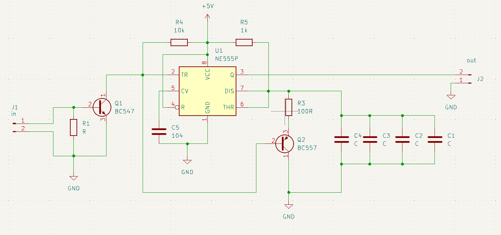
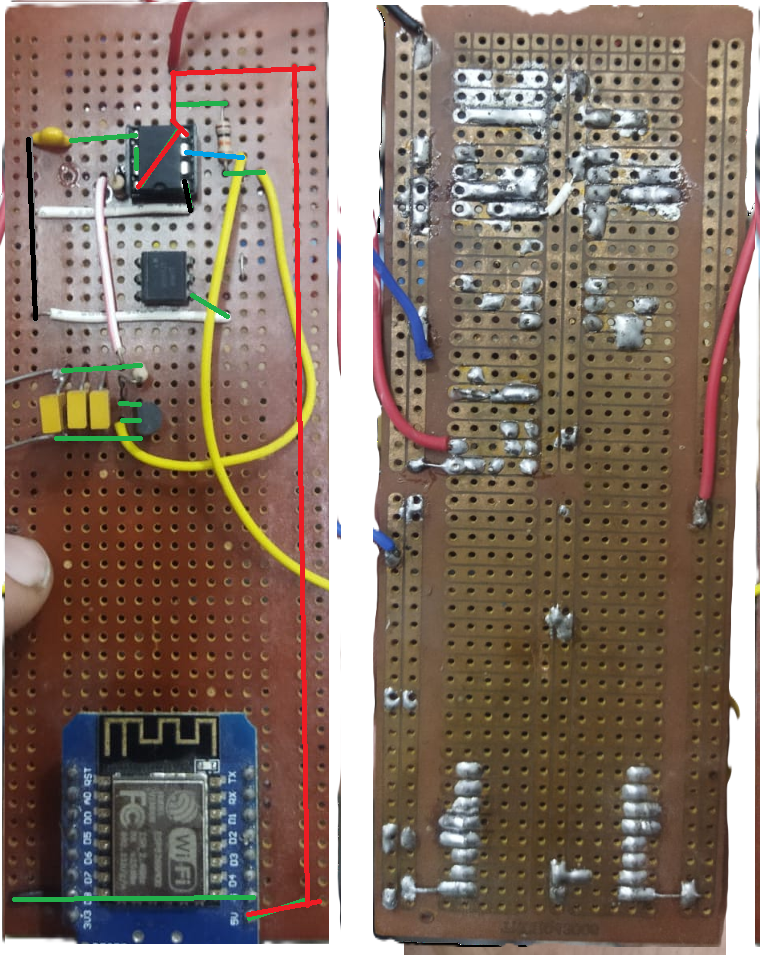

# weather_station_midea

---

## IR Remote Capture using One-Shot 555 Timer

This project implements IR signal capture using a one-shot monostable circuit built with a 555 timer. The purpose is to convert noisy or bursty IR remote signals into clean, fixed-width digital pulses for further processing with a microcontroller.

---

## Overview

- IR receiver output is connected to a monostable 555 timer circuit.
- Each IR pulse from the remote triggers a single, uniform pulse.
- These pulses are captured and processed by a microcontroller.

---

## Purpose

The monostable 555 circuit stabilizes the IR signal and generates one fixed-duration pulse per input trigger. This setup ensures better reliability when detecting IR remote activity, especially in environments with noise or signal bouncing.

---

## Timing

The output pulse width is tuned based on required detection response using standard monostable timing configuration. The selected timing ensures clear distinction between multiple IR pulses.

---

## Integration

The clean digital output from the 555 timer is routed to the microcontroller, where it is used for counting, triggering, or measuring time intervals between remote signals.

---

## Application

Useful in projects where:
- Clean edge detection of IR signals is needed
- Pulse counting is required
- IR signals need conditioning before software processing

---
# Using PulseView with a Logic Analyzer

## 555 Timer Circuit Overview

The **555 timer** is a versatile IC commonly used to generate square waves in astable mode. In this setup, it continuously switches between high and low states, creating a periodic digital signal. The frequency and duty cycle of the output waveform depend on the connected resistors and capacitor values.

In this guide, we’ll use a logic analyzer and **PulseView** software to capture and analyze the output waveform from a 555 timer circuit. This process allows you to examine timing characteristics and convert the waveform into a format suitable for further digital signal processing (e.g., Pronto codes).

---

## Software Installation

To capture and analyze the signal from the 555 timer, we use **PulseView**, a graphical frontend for the sigrok logic analyzer software suite.

**Download Link:**  
[https://sigrok.org/wiki/Downloads](https://sigrok.org/wiki/Downloads)

1. Scroll to the **PulseView** section.
2. Download the installer according to your operating system (Windows, macOS, or Linux).
3. Follow the on-screen instructions to complete installation.

---

## Connecting the Logic Analyzer

To use the logic analyzer with PulseView:

1. **Connect the Logic Analyzer** to your computer via USB.
2. Connect one of the input channels (e.g., D0) to the **output of the 555 timer**.
3. Connect the **GND** pin of the logic analyzer to the **common ground** of your circuit.
4. Open **PulseView**.
5. From the device dropdown in the toolbar, select your connected logic analyzer (e.g., `fx2lafw`).
6. Set the **sampling rate** to **1 MHz**.
7. Select the channel you connected (e.g., D0).
8. Click the **"Run"** button to begin capturing data.

---

## Exporting Gray Code from PulseView

Once the signal is captured:

1. Zoom in to verify the structure of the pulse waveform.
2. Right-click on the data channel (e.g., D0) and select **"Export as..."**.
3. In the export window:
   - Choose **"CSV"** or **"TXT"** format.
   - Choose **"Transitions"** as the export type. This records all rising and falling edges.
4. Click **"Export"** and save the file.

The exported file will contain the **timestamped transitions** (high and low durations), which represent the **on and off** times of the IR waveform — effectively forming a **Gray code-like structure** that your Python script can process into **Pronto codes**.

**Author:** Ahmed  

